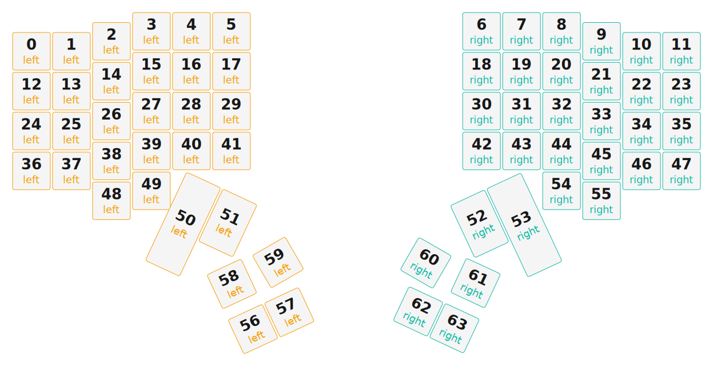

# ZMK Configuration for manuform_5x6

*Generated by Shield Wizard for ZMK*



Download compiled firmware from the Actions tab. <https://zmk.dev/docs/user-setup#installing-the-firmware>

Edit your keymap <https://zmk.dev/docs/keymaps>.
User keymap is located at [`config/manuform_5x6.keymap`](config/manuform_5x6.keymap).

-----

<details>
<summary>
Shield Wizard Debug Information
</summary>

In case of broken configuration, here is the Shield Wizard internal data used to generate this configuration:

Commit: 1bc308cbed65fac144201644c2075be718bdbf1f

```json
{"name":"manuform_5x6","shield":"manuform_5x6","dongle":false,"modules":[],"layout":[{"id":"01KKMP9AFNSXAGMJBTMD0SF3C9","part":0,"row":0,"col":0,"w":1,"h":1,"x":0,"y":0.5,"r":0,"rx":0,"ry":0},{"id":"01KKMP9AQENKVWPN7H6FCSX6GT","part":0,"row":0,"col":1,"w":1,"h":1,"x":1,"y":0.5,"r":0,"rx":0,"ry":0},{"id":"01KKMP9AYPM4S2ZY7FWE3SH0XW","part":0,"row":0,"col":2,"w":1,"h":1,"x":2,"y":0,"r":0,"rx":0,"ry":0},{"id":"01KKMP9B5FY6AF46JS2RGKRCT8","part":0,"row":0,"col":3,"w":1,"h":1,"x":3,"y":0,"r":0,"rx":0,"ry":0},{"id":"01KKMP9BB8WV7H5PY3HB2ZY3QY","part":0,"row":0,"col":4,"w":1,"h":1,"x":4,"y":0.25,"r":0,"rx":0,"ry":0},{"id":"01KKMP9BJ0DRCSJCMN6GBG761C","part":0,"row":0,"col":5,"w":1,"h":1,"x":5,"y":0.25,"r":0,"rx":0,"ry":0},{"id":"01KKMPA5P03APK58G9SACMSJAF","part":1,"row":0,"col":6,"w":1,"h":1,"x":11.75,"y":0.25,"r":0,"rx":0,"ry":0},{"id":"01KKMPA5TN0SW83XA46MNWSBB4","part":1,"row":0,"col":7,"w":1,"h":1,"x":12.75,"y":0.25,"r":0,"rx":0,"ry":0},{"id":"01KKMPA60XB4XMR7ZR0SN8TB3D","part":1,"row":0,"col":8,"w":1,"h":1,"x":13.75,"y":0,"r":0,"rx":0,"ry":0},{"id":"01KKMPA66KT7M82WAX7DW3G4S8","part":1,"row":0,"col":9,"w":1,"h":1,"x":14.75,"y":0,"r":0,"rx":0,"ry":0},{"id":"01KKMPA6CDBD298VT8PGMPXGGC","part":1,"row":0,"col":10,"w":1,"h":1,"x":15.75,"y":0.5,"r":0,"rx":0,"ry":0},{"id":"01KKMPA6K4Q8MQTKPFWH3HVNWE","part":1,"row":0,"col":11,"w":1,"h":1,"x":16.75,"y":0.5,"r":0,"rx":0,"ry":0},{"id":"01KKMPAKPCJX8KXWZ5W2XCD75Z","part":0,"row":1,"col":0,"w":1,"h":1,"x":0,"y":1.5,"r":0,"rx":0,"ry":0},{"id":"01KKMPAKWNJZF8ZZS8F3ZY2H0G","part":0,"row":1,"col":1,"w":1,"h":1,"x":1,"y":1.5,"r":0,"rx":0,"ry":0},{"id":"01KKMPAM2WH4VA7J13RHKRFZMJ","part":0,"row":1,"col":2,"w":1,"h":1,"x":2,"y":1,"r":0,"rx":0,"ry":0},{"id":"01KKMPAM9596717H69R97XMJ6J","part":0,"row":1,"col":3,"w":1,"h":1,"x":3,"y":1,"r":0,"rx":0,"ry":0},{"id":"01KKMPAMEZG8Q1R8Z78V7PV2EV","part":0,"row":1,"col":4,"w":1,"h":1,"x":4,"y":1.25,"r":0,"rx":0,"ry":0},{"id":"01KKMPAMN7XFX1JMEJA75Y9PYP","part":0,"row":1,"col":5,"w":1,"h":1,"x":5,"y":1.25,"r":0,"rx":0,"ry":0},{"id":"01KKMPATZSKCYNXZV99CY10PWZ","part":1,"row":1,"col":6,"w":1,"h":1,"x":11.75,"y":1.25,"r":0,"rx":0,"ry":0},{"id":"01KKMPAV5M8KHXDCJM2CYGQ565","part":1,"row":1,"col":7,"w":1,"h":1,"x":12.75,"y":1.25,"r":0,"rx":0,"ry":0},{"id":"01KKMPAVBQ0PB9877F21KYF7RX","part":1,"row":1,"col":8,"w":1,"h":1,"x":13.75,"y":1,"r":0,"rx":0,"ry":0},{"id":"01KKMPAVHY29XPW0A9F4TA5H4N","part":1,"row":1,"col":9,"w":1,"h":1,"x":14.75,"y":1,"r":0,"rx":0,"ry":0},{"id":"01KKMPAVR5W14FDEC79MP8KAPV","part":1,"row":1,"col":10,"w":1,"h":1,"x":15.75,"y":1.5,"r":0,"rx":0,"ry":0},{"id":"01KKMPAVXCK0BTZ2G5920BGPDK","part":1,"row":1,"col":11,"w":1,"h":1,"x":16.75,"y":1.5,"r":0,"rx":0,"ry":0},{"id":"01KKMPC2M2G179A634SRZDNCWR","part":0,"row":2,"col":0,"w":1,"h":1,"x":0,"y":2.5,"r":0,"rx":0,"ry":0},{"id":"01KKMPC2S5BAC464QKHN7NDQJ4","part":0,"row":2,"col":1,"w":1,"h":1,"x":1,"y":2.5,"r":0,"rx":0,"ry":0},{"id":"01KKMPC30H9S4QY6QE1AWFEPWC","part":0,"row":2,"col":2,"w":1,"h":1,"x":2,"y":2,"r":0,"rx":0,"ry":0},{"id":"01KKMPC36CCKHEP9P6XG3XDREJ","part":0,"row":2,"col":3,"w":1,"h":1,"x":3,"y":2,"r":0,"rx":0,"ry":0},{"id":"01KKMPC3CK91XYG8692TJCKB71","part":0,"row":2,"col":4,"w":1,"h":1,"x":4,"y":2.25,"r":0,"rx":0,"ry":0},{"id":"01KKMPC3JW7DWCK5WJPAJYFESN","part":0,"row":2,"col":5,"w":1,"h":1,"x":5,"y":2.25,"r":0,"rx":0,"ry":0},{"id":"01KKMPC3SH0QK2YYNVA031F846","part":1,"row":2,"col":6,"w":1,"h":1,"x":11.75,"y":2.25,"r":0,"rx":0,"ry":0},{"id":"01KKMPC3ZTBGXD5T0QDT8JVN92","part":1,"row":2,"col":7,"w":1,"h":1,"x":12.75,"y":2.25,"r":0,"rx":0,"ry":0},{"id":"01KKMPC55QFDP3XMV5T50TPA47","part":1,"row":2,"col":8,"w":1,"h":1,"x":13.75,"y":2,"r":0,"rx":0,"ry":0},{"id":"01KKMPC5CGK6ARAZTM98E1RR9K","part":1,"row":2,"col":9,"w":1,"h":1,"x":14.75,"y":2,"r":0,"rx":0,"ry":0},{"id":"01KKMPC5MT7K2RRA2KJNPXX4V9","part":1,"row":2,"col":10,"w":1,"h":1,"x":15.75,"y":2.5,"r":0,"rx":0,"ry":0},{"id":"01KKMPC5X5W8MQ2J7KGPXFPJ6J","part":1,"row":2,"col":11,"w":1,"h":1,"x":16.75,"y":2.5,"r":0,"rx":0,"ry":0},{"id":"01KKMPCP1VF3X8SD63T8HGF7R4","part":0,"row":3,"col":0,"w":1,"h":1,"x":0,"y":3.5,"r":0,"rx":0,"ry":0},{"id":"01KKMPCP7034PMXQVWPRJ6B8TD","part":0,"row":3,"col":1,"w":1,"h":1,"x":1,"y":3.5,"r":0,"rx":0,"ry":0},{"id":"01KKMPCPCQT2RDNS9FQ7E50A5A","part":0,"row":3,"col":2,"w":1,"h":1,"x":2,"y":3,"r":0,"rx":0,"ry":0},{"id":"01KKMPCPKHK3E7P2RRK61T2FDF","part":0,"row":3,"col":3,"w":1,"h":1,"x":3,"y":3,"r":0,"rx":0,"ry":0},{"id":"01KKMPCPS8YCS79PWGVBAVCV19","part":0,"row":3,"col":4,"w":1,"h":1,"x":4,"y":3.25,"r":0,"rx":0,"ry":0},{"id":"01KKMPCPYZ3RJWWEDWQX5QGEJX","part":0,"row":3,"col":5,"w":1,"h":1,"x":5,"y":3.25,"r":0,"rx":0,"ry":0},{"id":"01KKMPCQ4VR4VP9N1A5FWYJ344","part":1,"row":3,"col":6,"w":1,"h":1,"x":11.75,"y":3.25,"r":0,"rx":0,"ry":0},{"id":"01KKMPCQAES8TGXDZSSVXAGP6N","part":1,"row":3,"col":7,"w":1,"h":1,"x":12.75,"y":3.25,"r":0,"rx":0,"ry":0},{"id":"01KKMPCQGPNWTZ1F09JHM4QXXP","part":1,"row":3,"col":8,"w":1,"h":1,"x":13.75,"y":3,"r":0,"rx":0,"ry":0},{"id":"01KKMPCQPY0YZCK0ND0Z6Q51KV","part":1,"row":3,"col":9,"w":1,"h":1,"x":14.75,"y":3,"r":0,"rx":0,"ry":0},{"id":"01KKMPCQXVFYBHCECR9A5VFBAV","part":1,"row":3,"col":10,"w":1,"h":1,"x":15.75,"y":3.5,"r":0,"rx":0,"ry":0},{"id":"01KKMPCR4Y4Y48GVGDG40ZHPRK","part":1,"row":3,"col":11,"w":1,"h":1,"x":16.75,"y":3.5,"r":0,"rx":0,"ry":0},{"id":"01KKMPFBEMAQQ78E1MA9EEGWEK","part":0,"row":4,"col":2,"w":1,"h":1,"x":2,"y":4,"r":0,"rx":0,"ry":0},{"id":"01KKMPFBNMSNQ4ADTW52MSWJNC","part":0,"row":4,"col":3,"w":1,"h":1,"x":3,"y":4,"r":0,"rx":0,"ry":0},{"id":"01KKMPFBW5RH8ZB5KNT41CMBJQ","part":0,"row":4,"col":4,"w":1,"h":2.5,"x":6,"y":1.5,"r":30,"rx":0,"ry":0},{"id":"01KKMPFC4795BS13FMQ6EX6K1M","part":0,"row":4,"col":5,"w":1,"h":2,"x":7,"y":1.5,"r":30,"rx":0,"ry":0},{"id":"01KKMPFCDCKQ022RWEK4CQYKP1","part":1,"row":4,"col":6,"w":1,"h":2,"x":7.25,"y":10.25,"r":-30,"rx":0,"ry":0},{"id":"01KKMPFCNAXM27Z5VDKV9PY6NB","part":1,"row":4,"col":7,"w":1,"h":2.5,"x":8.25,"y":10.25,"r":-30,"rx":0,"ry":0},{"id":"01KKMPFCW03JW3V5R45SWSZBJG","part":1,"row":4,"col":8,"w":1,"h":1,"x":13.75,"y":4,"r":0,"rx":0,"ry":0},{"id":"01KKMPFD3XFRNH34G57HCCH22X","part":1,"row":4,"col":9,"w":1,"h":1,"x":14.75,"y":4,"r":0,"rx":0,"ry":0},{"id":"01KKMPH78PFP4F9ZWA3Y10A6ZH","part":0,"row":5,"col":2,"w":1,"h":1,"x":1.5,"y":8.25,"r":-20,"rx":0,"ry":0},{"id":"01KKMPH9K4HWZ6P1YDG077JVDZ","part":0,"row":5,"col":3,"w":1,"h":1,"x":2.5,"y":8.25,"r":-20,"rx":0,"ry":0},{"id":"01KKMPH9V0RFFNP80M7JVZ0W41","part":0,"row":5,"col":4,"w":1,"h":1,"x":2.5,"y":9.25,"r":-20,"rx":0,"ry":0},{"id":"01KKMPHA1R762ECFDCNCD56XZN","part":0,"row":5,"col":5,"w":1,"h":1,"x":1.5,"y":9.25,"r":-20,"rx":0,"ry":0},{"id":"01KKMPHA91N20D2AQG610G5AF9","part":1,"row":5,"col":6,"w":1,"h":1,"x":14,"y":2.25,"r":20,"rx":0,"ry":0},{"id":"01KKMPHAGA6PCSSEJ6BVBNEH28","part":1,"row":5,"col":7,"w":1,"h":1,"x":14,"y":3.25,"r":20,"rx":0,"ry":0},{"id":"01KKMPHAQMTFQVE1YWH00RZWEB","part":1,"row":5,"col":8,"w":1,"h":1,"x":13,"y":3.25,"r":20,"rx":0,"ry":0},{"id":"01KKMPHB107P39K585BNRYG2W8","part":1,"row":5,"col":9,"w":1,"h":1,"x":13,"y":2.25,"r":20,"rx":0,"ry":0}],"parts":[{"name":"left","controller":"nice_nano_v2","wiring":"matrix_diode","pins":{"d9":"input","d8":"input","d7":"input","d6":"input","d5":"input","d4":"input","d19":"output","d18":"output","d15":"output","d14":"output","d16":"output","d10":"output"},"keys":{"01KKMP9AFNSXAGMJBTMD0SF3C9":{"input":"d4","output":"d19"},"01KKMPAKPCJX8KXWZ5W2XCD75Z":{"input":"d4","output":"d18"},"01KKMPC2M2G179A634SRZDNCWR":{"input":"d4","output":"d15"},"01KKMPCP1VF3X8SD63T8HGF7R4":{"input":"d4","output":"d14"},"01KKMP9AQENKVWPN7H6FCSX6GT":{"input":"d5","output":"d19"},"01KKMPAKWNJZF8ZZS8F3ZY2H0G":{"input":"d5","output":"d18"},"01KKMPC2S5BAC464QKHN7NDQJ4":{"input":"d5","output":"d15"},"01KKMPCP7034PMXQVWPRJ6B8TD":{"input":"d5","output":"d14"},"01KKMP9AYPM4S2ZY7FWE3SH0XW":{"input":"d6","output":"d19"},"01KKMPAM2WH4VA7J13RHKRFZMJ":{"input":"d6","output":"d18"},"01KKMPC30H9S4QY6QE1AWFEPWC":{"input":"d6","output":"d15"},"01KKMPCPCQT2RDNS9FQ7E50A5A":{"input":"d6","output":"d14"},"01KKMPFBEMAQQ78E1MA9EEGWEK":{"input":"d6","output":"d16"},"01KKMPH78PFP4F9ZWA3Y10A6ZH":{"input":"d6","output":"d10"},"01KKMP9B5FY6AF46JS2RGKRCT8":{"input":"d7","output":"d19"},"01KKMPAM9596717H69R97XMJ6J":{"input":"d7","output":"d18"},"01KKMPC36CCKHEP9P6XG3XDREJ":{"input":"d7","output":"d15"},"01KKMPCPKHK3E7P2RRK61T2FDF":{"input":"d7","output":"d14"},"01KKMPFBNMSNQ4ADTW52MSWJNC":{"input":"d7","output":"d16"},"01KKMPH9K4HWZ6P1YDG077JVDZ":{"input":"d7","output":"d10"},"01KKMP9BB8WV7H5PY3HB2ZY3QY":{"input":"d8","output":"d19"},"01KKMPAMEZG8Q1R8Z78V7PV2EV":{"input":"d8","output":"d18"},"01KKMPC3CK91XYG8692TJCKB71":{"input":"d8","output":"d15"},"01KKMPCPS8YCS79PWGVBAVCV19":{"input":"d8","output":"d14"},"01KKMPFBW5RH8ZB5KNT41CMBJQ":{"input":"d8","output":"d16"},"01KKMPH9V0RFFNP80M7JVZ0W41":{"input":"d8","output":"d10"},"01KKMP9BJ0DRCSJCMN6GBG761C":{"input":"d9","output":"d19"},"01KKMPAMN7XFX1JMEJA75Y9PYP":{"input":"d9","output":"d18"},"01KKMPC3JW7DWCK5WJPAJYFESN":{"input":"d9","output":"d15"},"01KKMPCPYZ3RJWWEDWQX5QGEJX":{"input":"d9","output":"d14"},"01KKMPFC4795BS13FMQ6EX6K1M":{"input":"d9","output":"d16"},"01KKMPHA1R762ECFDCNCD56XZN":{"input":"d9","output":"d10"}},"encoders":[],"buses":[{"name":"spi0","devices":[],"type":"spi"},{"name":"spi1","devices":[],"type":"spi"},{"name":"spi2","devices":[],"type":"spi"},{"name":"spi3","devices":[],"type":"spi"},{"name":"i2c0","devices":[],"type":"i2c"},{"name":"i2c1","devices":[],"type":"i2c"}]},{"name":"right","controller":"nice_nano_v2","wiring":"matrix_diode","pins":{"d4":"input","d5":"input","d6":"input","d7":"input","d8":"input","d9":"input","d10":"output","d16":"output","d14":"output","d15":"output","d18":"output","d19":"output"},"keys":{"01KKMPA6K4Q8MQTKPFWH3HVNWE":{"input":"d9","output":"d19"},"01KKMPAVXCK0BTZ2G5920BGPDK":{"input":"d9","output":"d18"},"01KKMPC5X5W8MQ2J7KGPXFPJ6J":{"input":"d9","output":"d15"},"01KKMPCR4Y4Y48GVGDG40ZHPRK":{"input":"d9","output":"d14"},"01KKMPA6CDBD298VT8PGMPXGGC":{"input":"d8","output":"d19"},"01KKMPAVR5W14FDEC79MP8KAPV":{"input":"d8","output":"d18"},"01KKMPC5MT7K2RRA2KJNPXX4V9":{"input":"d8","output":"d15"},"01KKMPCQXVFYBHCECR9A5VFBAV":{"input":"d8","output":"d14"},"01KKMPA66KT7M82WAX7DW3G4S8":{"input":"d7","output":"d19"},"01KKMPAVHY29XPW0A9F4TA5H4N":{"input":"d7","output":"d18"},"01KKMPC5CGK6ARAZTM98E1RR9K":{"input":"d7","output":"d15"},"01KKMPCQPY0YZCK0ND0Z6Q51KV":{"input":"d7","output":"d14"},"01KKMPFD3XFRNH34G57HCCH22X":{"input":"d7","output":"d16"},"01KKMPHB107P39K585BNRYG2W8":{"input":"d7","output":"d10"},"01KKMPA60XB4XMR7ZR0SN8TB3D":{"input":"d6","output":"d19"},"01KKMPAVBQ0PB9877F21KYF7RX":{"input":"d6","output":"d18"},"01KKMPC55QFDP3XMV5T50TPA47":{"input":"d6","output":"d15"},"01KKMPCQGPNWTZ1F09JHM4QXXP":{"input":"d6","output":"d14"},"01KKMPFCW03JW3V5R45SWSZBJG":{"input":"d6","output":"d16"},"01KKMPHAQMTFQVE1YWH00RZWEB":{"input":"d6","output":"d10"},"01KKMPA5TN0SW83XA46MNWSBB4":{"input":"d5","output":"d19"},"01KKMPAV5M8KHXDCJM2CYGQ565":{"input":"d5","output":"d18"},"01KKMPC3ZTBGXD5T0QDT8JVN92":{"input":"d5","output":"d15"},"01KKMPCQAES8TGXDZSSVXAGP6N":{"input":"d5","output":"d14"},"01KKMPFCNAXM27Z5VDKV9PY6NB":{"input":"d5","output":"d16"},"01KKMPHAGA6PCSSEJ6BVBNEH28":{"input":"d5","output":"d10"},"01KKMPA5P03APK58G9SACMSJAF":{"input":"d4","output":"d19"},"01KKMPATZSKCYNXZV99CY10PWZ":{"input":"d4","output":"d18"},"01KKMPC3SH0QK2YYNVA031F846":{"input":"d4","output":"d15"},"01KKMPCQ4VR4VP9N1A5FWYJ344":{"input":"d4","output":"d14"},"01KKMPFCDCKQ022RWEK4CQYKP1":{"input":"d4","output":"d16"},"01KKMPHA91N20D2AQG610G5AF9":{"input":"d4","output":"d10"}},"encoders":[],"buses":[{"name":"spi0","devices":[],"type":"spi"},{"name":"spi1","devices":[],"type":"spi"},{"name":"spi2","devices":[],"type":"spi"},{"name":"spi3","devices":[],"type":"spi"},{"name":"i2c0","devices":[],"type":"i2c"},{"name":"i2c1","devices":[],"type":"i2c"}]}]}
```

</details>
